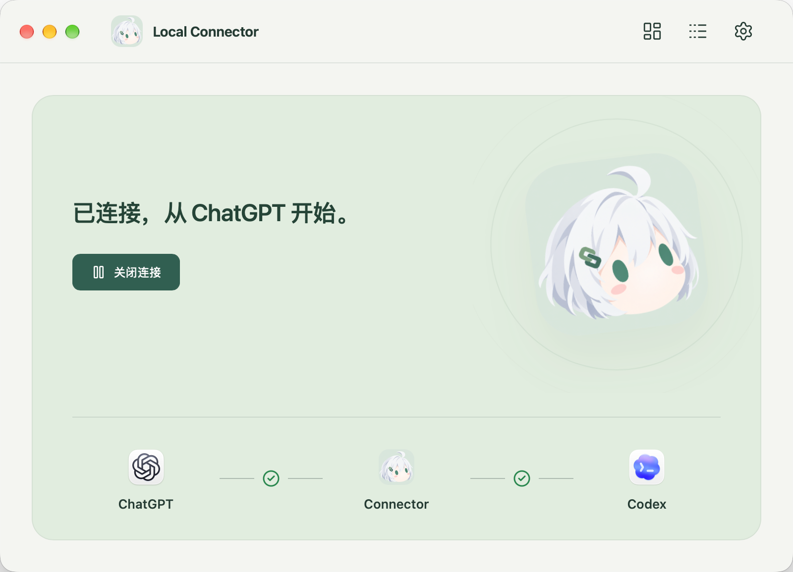

# ChatGPT Local Connector

**在 ChatGPT 里聊想法，让本机的 Codex 接着干。**

Local Connector 是 ChatGPT 和 Codex Desktop 之间的小小联络员。它通过OpenAI Secure MCP Tunnel 或 HTTPS MCP，把对话接到你的电脑上：查项目、读代码、看 Git 状态，再把任务交给 Codex，回来接着聊进展。



- **少一点复制粘贴**：让 ChatGPT 直接读取本机项目、文件和 Git 状态，讨论有据可依。
- **聊到哪，做到哪**：在对话里创建、续接或中断 Codex 任务，也能查看任务进展和结果。
- **连接有人照看**：应用负责 Tunnel Client 的下载、校验、配置和启停，连接状态一眼可见。

日常使用无需安装 Node、npm、Rust 或 Cargo。当前支持 **Apple Silicon Mac** 的完整接入；Windows 提供桌面预览包，尚不支持同等的 Desktop 任务接入。

## 安装

安装包与可用版本以 [GitHub Releases](https://github.com/whzxc/chatgpt-local-connector/releases/latest) 为准。直接安装、Homebrew、系统拦截、更新与卸载见 [安装指南](docs/installation.md)。

## 让 Codex 帮你配置（推荐）

在这台电脑的 Codex 中发送下面的消息。Codex 会检查已有进度，完成安装、配置、排障和验收；需要登录、授权或填写凭据时再由你操作。默认使用官方 OpenAI Secure MCP Tunnel。

```text
请帮我在这台电脑上安装、配置并验收 ChatGPT Local Connector，默认使用官方 OpenAI Secure MCP Tunnel。先检查已有安装和配置；若应用提供 cli guide，请读取内嵌指南并用 cli doctor 继续，否则读取 https://github.com/whzxc/chatgpt-local-connector/blob/main/docs/codex-setup.md ，按实际发行版本操作。请完成能自动完成的安装、配置、排障和验收，只在需要我登录、授权、提供凭据或做必要选择时叫我；凭据让我直接填入本机应用，不要贴在聊天里。保留已有可用配置，不重复创建连接。最终分别确认本机连接、真实 ChatGPT 工具调用和无害 Codex 任务的完成结果；无法验证的部分明确说明。
```

之后遇到连接问题，也可以复制上面的消息，直接让 Codex 按同一指南排查。使用有本机命令执行能力的 Codex；ChatGPT 账号/工作区权限、Tunnel 身份和必要的用户授权仍需具备。

[Codex 操作指南与 CLI](docs/codex-setup.md)提供配置流程和诊断方式；以实际发行包内的 `cli help` / `cli guide` 为准。希望自己配置，可阅读[手动接入指南](docs/tunnel.md)。

## 日常使用

首次配置后，日常使用保持本机联网、Desktop 可用且 Connector 连接开启即可；登录时启动为可选设置。关闭窗口后连接继续运行，退出应用则关闭连接。macOS 可在「设置 → 通用 → 显示位置」选择「全部」「仅菜单栏」或「仅 Dock 栏」，修改立即生效并自动保存。

### 分工与边界

设置中的「自动打开 Codex 任务」默认开启，新任务由 Desktop 接管执行；关闭后，新任务由 Connector 后台执行，不自动打开 Desktop，也不保证可在 Desktop 中操作。开关仅影响新任务，已有任务仍由原执行方管理。关闭 Connector 会停止其后台执行，但不会主动中断 Desktop 所有的任务；未知状态不显示为空闲。

不按 Codex Desktop 应用版本号限制连接；可用性取决于实际 IPC 握手和所需操作是否受支持。私有协议可能随 Desktop 更新变化，连接成功不代表所有操作均兼容。

## 开发

```sh
npm ci
npm run dev:ui
```

技术栈是 **Tauri + Rust + Vue**：Rust 管理连接、配置、MCP 与 Desktop 通信，Vue 运行在系统 WebView 中。安装包不携带 Node、npm、Rust 或 Cargo，Node 仅用于源码开发和前端构建。

开发需要 Node 24.12+、Rust stable 和对应平台 SDK。Dev 界面使用 Vite 热更新，与正在运行的构建版共用同一个后台，可直接操作配置、连接与任务。请先打开构建版；Dev 不启动独立后台。

相关文档：

- [安装与更新](docs/installation.md)
- [发布维护](docs/release.md)
- [版本说明](CHANGELOG.md)
- [开发与构建](docs/development.md)
- [桌面生命周期](docs/desktop.md)
- [MCP 工具与任务边界](docs/tools.md)
- [架构说明](docs/architecture.md)

本机数据默认位于 macOS 的 `~/.local/state/chatgpt-local-connector` 或 Windows 的 `%LOCALAPPDATA%/chatgpt-local-connector`，可通过 `CLC_STATE_DIR` 指定。密钥、回执和日志只保存在本机；卸载应用不会删除 Codex 历史。

采用 [MIT 许可证](LICENSE)。源码与桌面安装包使用 GitHub 分发，不发布公共 npm 包。
