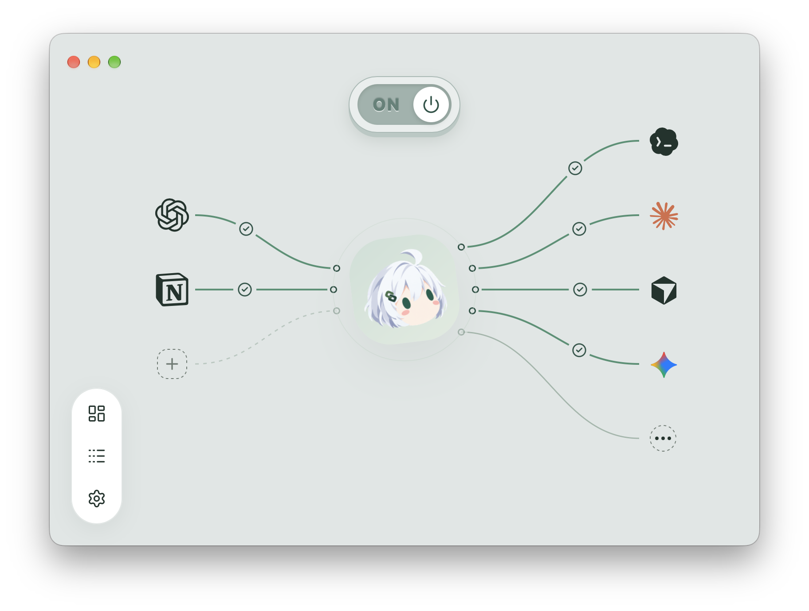

# ChatGPT Local Connector

[English](README.md) | **简体中文**

支持多个 MCP 控制来源并发接入，共享同一个 Core。HTTPS 服务商包括 Cloudflare、ngrok、Pinggy、LocalXpose 和自定义域名；连接组件首次使用时按需下载。

**在 ChatGPT 里聊想法，让本机的 coding agent 接着干。**

CLC 并不是从“给 ChatGPT 再加一堆工具”开始的。它来自一个困扰我很久的实际工作问题，而且每一阶段，都是上一个问题解决之后自然长出来的。



## 为什么会有 Local Connector

### 第一阶段：让 Chat 看到“现在真实是什么”

我很长时间都在 ChatGPT 的 Chat 模式里讨论工作，但一个问题反复出现：Chat 可以延续对话，却看不到电脑上刚刚发生的变化。项目可能已经改了，架构决策可能调整了，Codex 也可能刚完成一轮工作，但 Chat 仍会拿几天前甚至更旧的上下文继续推理。每次都手工复制文件、diff 和最新状态，久而久之本身就成了新的负担。

所以第一版 CLC 很简单：通过 MCP 把本机项目事实源接给 ChatGPT，让它在需要时直接读取当前文件、代码、文档、项目结构和 Git 状态。目标不是让 Chat “记住更多”，而是让它随时能自己确认“现在真实是什么”。

### 第二阶段：把 Chat 里的讨论直接变成 Codex 的任务

当 Chat 已经能看到设备上的实时状态，下一步就很自然：既然能读文件，为什么不能执行命令、查看我最近在 Codex 里做了什么，甚至直接替我创建和续接任务？

于是 CLC 继续把 MCP 接到了 Codex App Server。现在 ChatGPT 可以读取本机 Codex 的工作记录，创建、续接或中断任务，并持续回读进度和结果。最终形成了我真正想要的工作流：先在 Chat 里基于实时项目事实把方案聊清楚，再把结论变成明确的 Codex 任务交给本机执行，之后仍然在同一个对话里持续跟进。只要设备在线，我不必坐在电脑前，也能通过 ChatGPT 查看和推进任务。

### 第三阶段：从控制一个 Agent，扩展成 Agent 控制层

当 ChatGPT 已经可以协调 Codex 后，只支持一个 Agent 就显得没有必要了。了解到 ACP 之后，我把这套控制模型继续扩展到其他本地 Agent，希望一步覆盖主流 ACP 生态。现在 Pi、OpenCode，以及 Gemini、Claude adapter、Cursor、Grok、Copilot、Kimi、Qwen、Kiro、Devin、Cline、Junie、Hermes 等 Agent，都可以接入同一套工作流。

这也是 CLC 的演进方向：从“让 ChatGPT 能读我的本机项目”，变成“让 ChatGPT 能协调发生在这台机器上的工作”。Chat 负责讨论、推理和基于事实做决策，本地 Agent 负责执行，CLC 负责把两边连接起来，并让整个过程始终可见、可跟进。

## 现在它解决什么

- **少一点复制粘贴**：让 ChatGPT 直接读取本机项目、文件和 Git 状态，始终基于当前事实讨论。
- **把讨论直接变成任务**：在同一个对话里创建、续接或中断 Codex 和其他 Agent 的任务。
- **不中断上下文地跟进执行**：通过 `agent_wait`（Codex 原生入口为 `codex_wait`）等待完成、失败或需要交互，单次最长五分钟；超时不会终止任务。
- **用一套控制层协调多个 Agent**：Codex 保持原生能力并作为默认 Agent，Pi、OpenCode、内置 ACP Agent 和 Custom ACP 共用 `agent_*` 工作流。
- **连接本身有人照看**：应用负责 Tunnel Client 的下载、校验、配置和启停，并显示当前连接状态。

CLC 本身运行无需安装 Node、npm、Rust 或 Cargo；外部 Agent 仍使用各自所需的运行环境。支持 **Apple Silicon Mac** 和 **Windows x64** 的 Desktop 任务接入。

Codex 保持默认，原生能力完整保留。所有外部 Agent 沿用自身配置和登录；首页右侧的“更多”入口打开 Agents 管理面板，按品牌显示安装状态和版本，并支持启用已安装的 Agent；标题旁的设置按钮打开外观、额度和用量设置。额度监控和用量估算见[订阅用量](docs/subscriptions.md)。native/adapter 类型与能力见[本地 Agents](docs/agents.md)，公共任务操作统一使用 `agent_*` 工具。

## 安装

安装包与可用版本以 [GitHub Releases](https://github.com/whzxc/chatgpt-local-connector/releases/latest) 为准。直接安装、Homebrew、系统拦截、更新与卸载见 [安装指南](docs/zh-CN/installation.md)。

## 让 Codex 帮你配置（推荐）

在这台电脑的 Codex 中发送下面的消息。Codex 会检查已有进度，完成安装、配置、排障和验收；可提供已登录的 ChatGPT 网页让它继续代操作；只有本人确认或工具无法可靠完成的步骤再由你操作。默认使用官方 OpenAI Secure MCP Tunnel。

```text
请在这台电脑上安装、配置并完整验收 ChatGPT Local Connector。默认使用官方 Secure MCP Tunnel，保留已有可用 Tunnel / HTTPS 配置，不引入 CLC 云服务或公共 relay。先检查安装，读取 cli help、cli guide、cli doctor；没有 CLI 时读取 https://github.com/whzxc/chatgpt-local-connector/blob/main/docs/codex-setup.md ，按实际发行版本操作。
优先自动完成所有可自动化步骤。若我提供已登录 ChatGPT 的网页或浏览器环境，请实际使用可用的浏览器 / GUI / Computer Use 操作当前可见页面：检查 Developer Mode、复用或创建自定义 MCP、填入连接资料、刷新工具并选用连接。不要仅给我操作教程；不使用私有 API、Cookie 提取、固定 DOM 脚本或绕过安全机制。
通过 cli onboarding / status 自行读取 URL、Tunnel ID、配置和验证消息，不让我转抄本机已有值。已有安全本机凭据通过 stdin 配置；缺失密钥让我直接填入应用，不发到聊天。只在确需本人登录、身份确认、授权、验证码、管理员权限，或当前工具无法可靠操作时暂停，说明具体阻塞并只给最少动作；完成后继续。
自动从 ChatGPT 调用 connector_verify，并核对本轮验证码、工具结果和本机 challengeVerifiedAt；然后通过同一连接执行无害 Codex 任务（不调用工具、不读取或修改文件，只回复 CLC_ONBOARDING_OK），读取持久化回执、原生 threadId / turnId 和完成输出。未知状态按原 requestId 回读，不重复派单。分别报告本机就绪、ChatGPT 入站、任务完成的真实证据，不能把打开页面或 Tunnel ready 当成接入成功。
```

之后遇到连接问题，也可以复制上面的消息，直接让 Codex 按同一指南排查。使用有本机命令执行能力的 Codex；ChatGPT 账号/工作区权限、Tunnel 身份和必要的用户授权仍需具备。

[Codex 操作指南与 CLI](docs/zh-CN/codex-setup.md)提供配置流程和诊断方式；以实际发行包内的 `cli help` / `cli guide` 为准。希望自己配置，可阅读[手动接入指南](docs/zh-CN/tunnel.md)。

## 日常使用

在「设置 → 通用 → 语言」选择 Auto / English / 简体中文。Auto 跟随系统或浏览器语言，不支持的语言回退为 English；手动选择优先并自动保存，切换立即生效。语言偏好与主题一样保存在当前 WebView/浏览器中，不影响 MCP 工具、任务内容或协议。

首次配置后，日常使用保持本机联网、Desktop 可用且 Connector 连接开启即可；登录时启动为可选设置。关闭窗口后连接继续运行，退出应用则关闭连接。macOS 可在「设置 → 通用 → 显示位置」选择「全部」「仅菜单栏」或「仅 Dock 栏」，修改立即生效并自动保存。

`agent_wait` 支持 Codex、Pi、全部内置 ACP 与 Custom ACP，在本机连接期间等待；`codex_wait` 保留原生语义。历史读取和事件查询继续使用相应的 read/events 工具。普通 Chat 回复结束后不会继续后台等待；它不提供定时唤醒或主动推送。详见[等待工具](docs/tools.md#任务等待)。

### 分工与边界

设置中的「自动打开 Codex 任务」默认开启，新任务由 Desktop 接管执行；关闭后，新任务由 Connector 后台执行，不自动打开 Desktop，也不保证可在 Desktop 中操作。开关仅影响新任务，已有任务仍由原执行方管理。关闭 Connector 会停止其后台执行，但不会主动中断 Desktop 所有的任务；未知状态不显示为空闲。

不按 Codex Desktop 应用版本号限制连接；可用性取决于实际 IPC 握手和所需操作是否受支持。私有协议可能随 Desktop 更新变化，连接成功不代表所有操作均兼容。

## 开发

```sh
npm ci
npm run dev:ui
```

技术栈是 **Tauri + Rust + Vue**：Rust 管理连接、配置、MCP 与 Desktop 通信，Vue 运行在系统 WebView 中。安装包不携带 Node、npm、Rust 或 Cargo，Node 仅用于源码开发和前端构建。

开发需要 Node 24.12+、Rust stable 和对应平台 SDK。Dev 界面使用 Vite 热更新，与正在运行的构建版共用同一个后台，可直接操作配置、连接与任务。请先打开构建版；Dev 不启动独立后台。

相关文档：

- [安装与更新](docs/zh-CN/installation.md)
- [发布维护](docs/release.md)
- [版本说明](CHANGELOG.md)
- [开发与构建](docs/development.md)
- [桌面生命周期](docs/desktop.md)
- [MCP 工具与任务边界](docs/tools.md)
- [架构说明](docs/architecture.md)

本机数据默认位于 macOS 的 `~/.local/state/chatgpt-local-connector` 或 Windows 的 `%LOCALAPPDATA%/chatgpt-local-connector`，可通过 `CLC_STATE_DIR` 指定。密钥、回执和日志只保存在本机；卸载应用不会删除 Codex 历史。

采用 [MIT 许可证](LICENSE)。源码与桌面安装包使用 GitHub 分发，不发布公共 npm 包。

控制源固定为 ChatGPT、Claude、Microsoft Copilot、Notion、Slack、Cursor、GitHub Copilot、Raycast，另保留 Custom。同类型可反复添加，默认名称自动追加数字。认证兼容边界见[支持矩阵](docs/zh-CN/control-sources.md)。

HTTPS 连接支持 OAuth 2.1，包含本机授权确认、PKCE、动态客户端注册、令牌刷新和授权撤销。详见 [OAuth 认证](docs/oauth.md)。
